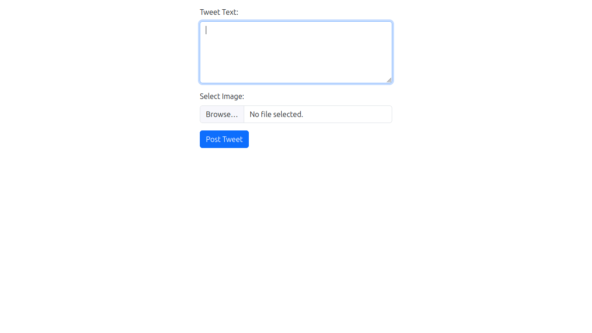

# Twitter/X API v2 Connectivity Demo with Python FastAPI

X has officially launched version 2 of the Twitter API. And despite Elon Musk's threats to discontinue all free access to the API, there **is** a [free tier](https://developer.twitter.com/en/docs/twitter-api/getting-started/about-twitter-api) available. It is quite limited, however. Free users can only access the endpoints to upload media, create tweets (up to 500 per month), and manage their own user data. They can't view tweets, like tweets, retweet tweets, or reply to tweets. They can't even view their own timeline. The free-tier endpoints also don't support application authentication, so you have to use Oauth2 user authentication, in which the user manually logs into their account and authorizes the app to use it.

(Note that it is still possible to create an automated bot. You will just have to manually authorize it when you first spin it up, and then the bot can continually generate refresh tokens to keep itself logged in. This is a bit of a pain, because it requires database storage of refresh tokens and regular workflow runs to generate new ones. That is, however, outside the scope of this demo.)

Currently, the documentation for API connectivity via the free tier is extremely limited. In the absence of good docs, I've created this demo to illustrate how to connect to the v2 API via a Python FastAPI application with PKCE flow. It's a little complicated, especially if you want to tweet media, because the media upload endpoint still uses OAuth1, whereas the tweet endpoint uses OAuth2. So you have to use both authentication methods in the same app.

## Setup

This demo repo uses the the `uv` package manager to manage dependencies. If you don't already have `uv` installed, you can install it with the following curl command:

```bash
curl -LsSf https://astral.sh/uv/install.sh | sh
```

To verify install, use:

```bash
uv --version
```

Consult the [uv installation docs](https://astral.sh/uv/) for more detailed instructions and troubleshooting.

Once uv is installed on your system, clone this repo with:

```bash
git clone https://github.com/Promptly-Technologies-LLC/X_twitter_api_v2_demo
```

Then:

1. Navigate to the cloned directory with `cd X_twitter_api_v2_demo`.
2. Install dependencies with `uv sync`.
3. Copy the `example.env` file to `.env` with `cp example.env .env`.
4. Edit the `.env` file and add your API key, API secret, client token, client secret, access token, and access secret (for instructions on how to get these, see below).

## Configuration

### Getting an API key and secret

Before you can run the app, you need to configure your Twitter API credentials. To do this, you need to [sign up for a Twitter/X developer account](https://developer.twitter.com/). Upon creating your account, you will receive an API key and an API secret. Save these in your `.env` file. 

### Getting a client token and secret

Next, create a new project and application from the developer dashboard. Then, from the application settings, do your user authentication setup. Give your application "Read and Write" permissions, classify it as a "Web App", and set the Callback URI to "http://127.0.0.1:5000/oauth/callback". Enter any URL you like for the required "Website" field; this won't affect our application. Upon saving these settings, you will be provided a client token and secret, which you should save to your `.env` file.

### Getting an access token and secret

You will also need to generate an access token and secret from your application's "Keys and Tokens" section in the developer dashboard. Save these to your `.env` file.

## Usage

To run the application, use:

```bash
uv run python main.py
```

This will start a FastAPI server on port 5000. You can then navigate to [http://127.0.0.1:5000](http://127.0.0.1:5000) in a web browser to view the app.

The app consists of a simple form that allows you to input text and select an image to go with the text. Supply some text and then click "Post Tweet". You will be redirected to Twitter to authenticate with your account. Once you authenticate, you will be redirected back to the app, which will display a link to your posted tweet.



That's it. That's all this app does. It's just a simple demo to illustrate how to connect to the Twitter API v2 via Python FastAPI.
